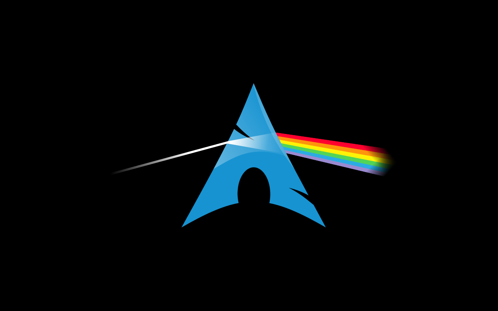

# Archlinux wallpaper: Dark Side of the Moon

Vector version of the popular "Dark side of the moon" Archlinux wallpaper.

## License

This is own work, inspired by an existing raster image from an unknown
author (help me trace him/her if you can).

Copyright © 2016 Samuele Santi

 This work is licensed under a [Creative Commons Attribution-ShareAlike 4.0 International License](http://creativecommons.org/licenses/by-sa/4.0/).
